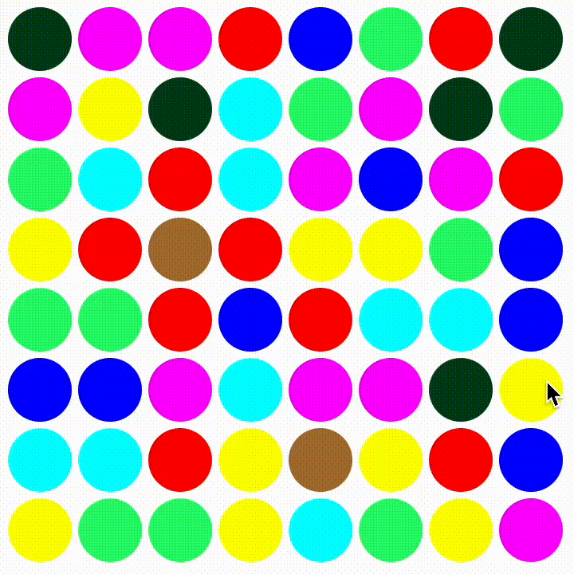

# Игра "3 в ряд"

Это классическая игра "3 в ряд" (match-3), вдохновленная механиками популярной игры "Сокровища Монтесумы". В игре реализованы механики смены шаров, падения элементов, их лопания при образовании ряда.

## Разработчики
Мы — студенты 3 курса, 8 группы Факультета ПММ, ВИВОЭВМ.

- **Арсений Копаев**  
- **Влад Бережнов**  
- **Сергей Козлов**
